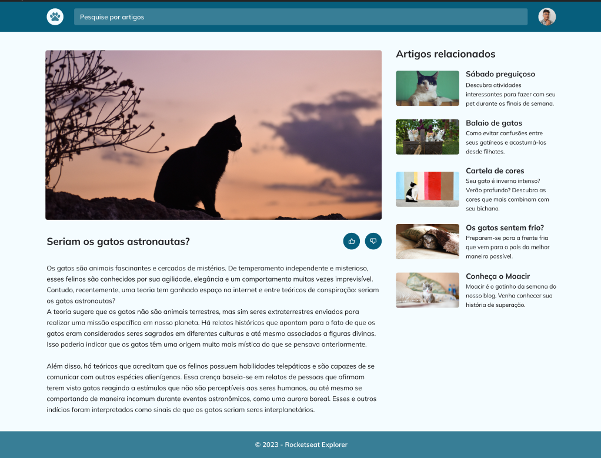

# Uso do Display | Explorer Stage 3

### Essa tarefa faz parte do curso Explorer da [Rocketseat](https://www.rocketseat.com.br).

Nessa atividade foi criado um blog com ênfase em:

- Conceitos do Display Grid;
- Uso da responsividade;
- Unidade de medida flexível;
- Variáveis em CSS e cores HSL;
- Animações e transições simples.

## 🔖 Layout 

Figma do projeto disponível nesse [Link](<https://www.figma.com/file/KaZkKMd12Tnl9szLjnQdmW/Blog-de-Gatos-%E2%80%A2-Desafio-Explorer-(Community)?node-id=0%3A1&mode=dev>).